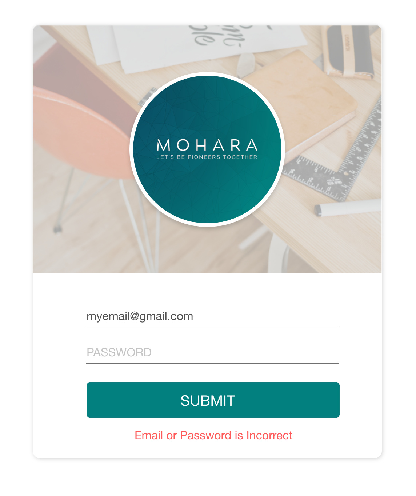

## Prerequirest

- Node v8+
- Git

## Setup Exam

```
$ git clone https://github.com/wachmohara/mohara-dev-screen.git
$ npm install
```

## I. Front-end UI and Layout


**Layout stuff**
- card
  - dimension 480*600 px
  - border-radius 10px
  - shadow 1px blur 6 px
- Avartar area 480*342 px background image opacity 37% ( fine out image at assets folder )
  - Make avatar look same design
- Input text look same design just only buttom underline input text even username/password
- Button border-radius 10px background color #027F7F text color #ffffff

**What we wloud like to see on this**
- Project structure
- How to handle and manage components for the project
- For more score over expectation
  - how to react component, state, props
  - how to service and handle state ( stage management as redux/mobx )


## II. UI Component & Service

Run command

```
$ npm run server
```

Let front-end ui request end at

 [POST] http://localhost:4003/api/login

```json
{
  "email" : String,
  "password" : String
}
```


> *** `email and password is`
```json
{
  "email" : "example@mohara.co",
  "password" : "password"
}
```

Please using request api by asyncronous function ( await/async ) when you waiting for response data from server and
Please make whatever componnent preloader to show on

Then http code `200` let Alert and message as `Login Successed`

If http code 40x let show seem like picture below

every submit form would clear error label




## III. JS & Unit Test

Run command

```
$ npm run test
```

The result would be as

Let edit `/utils/index.js` to write down the function


## Summary
> + This test for screen candidate simple logical `programing skill` and `front-end skill`
> + This test for make sure to our dicision to hire new member
> + Please do it by your best like the real world
> + No worry if you dont' make this test on time
